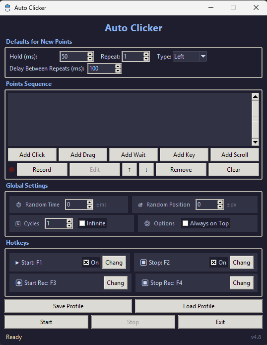

# Auto Clicker

A powerful, modern **Auto Clicker** with full mouse & keyboard automation, recording, profiles, and a clean dark UI.


---

## Features

- **Click, Drag, Scroll, Keyboard & Wait** actions in one sequence
- **Record** real mouse + keyboard actions and convert them into editable points
- **Hotkeys** for Start / Stop / Start Recording / Stop Recording (fully customizable)
- **Random delay** (±ms) and **random position** (±px) for more human-like behavior
- **Cycles** + Infinite mode
- **Save / Load** profiles (JSON)
- **Drag & drop** reordering of points
- Copy / Cut / Paste items (Ctrl+C / Ctrl+X / Ctrl+V)
- Live position preview when editing points
- Always-on-top option
- Clean dark theme (Catppuccin-inspired)


## Screenshots



## Requirements

- Python 3.8 or higher
- [pynput](https://pypi.org/project/pynput/)

```bash
pip install pynput
```

## How to Run
```bash
git clone https://github.com/tamimialiir/AutoCliker.git
cd AutoCliker
pip install pynput
python main.py
```

## Usage Guide

### Adding Actions
| Button          | Description                                          |
|-----------------|------------------------------------------------------|
| **Add Click**   | Click on screen to add a click point                 |
| **Add Drag**    | Click & hold, then release to define a drag          |
| **Add Wait**    | Insert a delay (in milliseconds)                     |
| **Add Key**     | Add a key or combination (`ctrl+c`, `alt+f4`...)     |
| **Add Scroll**  | Add mouse scroll (up/down) at a position             |
| **Record**      | Record live mouse + keyboard actions                 |


### Editing & Organizing
Double-click any item (or select + Edit) to modify it
Drag items in the list to reorder
Use ↑ / ↓ buttons or Delete key
Ctrl+C / Ctrl+X / Ctrl+V for copy / cut / paste

### Global Settings
Random Time: Adds random delay (±ms) to waits and repeats
Random Position: Slightly randomizes click/drag/scroll coordinates
Cycles: How many times the whole sequence should run
Infinite: Run forever until stopped
Always on Top: Keep the window above other windows

### Hotkeys (default)
| Action              | Default Key |
|---------------------|-------------|
| Start               | `F1`        |
| Stop                | `F2`        |
| Start Recording     | `F3`        |
| Stop Recording      | `F4`        |
You can change all hotkeys from the Hotkeys section.


## Profile System

Save Profile → exports current sequence + all settings to a .json file
Load Profile → restores everything (points, hotkeys, random settings, etc.)

Perfect for sharing macros or switching between different tasks.


## Tips

Use Record for complex sequences, then clean them up with Edit.
For more natural behavior, enable a small Random Time and Random Position.
You can name each point (optional) for better organization.
The app forces English keyboard layout on Windows when focused (helps with key recording).


## Supported Actions

| Action   | Description                                        |
|----------|----------------------------------------------------|
| Click    | Left / Right / Middle / Double click + hold time   |
| Drag     | Smooth drag from point A to point B                |
| Scroll   | Mouse wheel up or down at specific coordinates     |
| Key      | Single key or combinations (`ctrl+shift+s`...)     |
| Wait     | Precise delay in milliseconds                      |


## License
This project is licensed under the MIT License.
Feel free to use, modify and distribute.


## Contributing
Pull requests are welcome!
If you find a bug or have a feature idea, open an issue.


Made with ❤️ for automation lovers