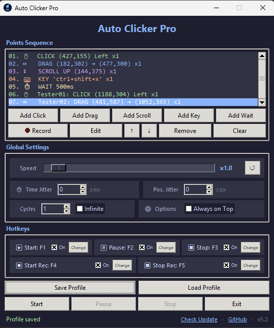

# Auto Clicker Pro (v5.2) 🚀

Auto Clicker Pro is a highly sophisticated, modular, and human-like automation utility designed to simulate complex mouse and keyboard sequences through a user-friendly, dark-themed interface based on the popular **Catppuccin** color palette. 


In version **v5.2**, the application framework has been completely re-engineered from the ground up. By transitioning to a professional, industry-standard **Modular Architecture**, the codebase is cleaner, more robust, and exceptionally easy to maintain or extend.

---

## Features

- **Click, Drag, Scroll, Keyboard & Wait** actions in one sequence
- **Record** real mouse + keyboard actions and convert them into editable points
- **Pause / Resume** — stop mid-sequence, edit the list freely, then continue
- **Speed control** (×0.1 – ×20) with live scaling of all delays, holds and drags
- **Hotkeys** for Start / Pause / Stop / Start Recording / Stop Recording (fully customizable, each can be enabled/disabled)
- **Time Jitter** (±ms) and **Position Jitter** (±px) for more human-like behavior
- **Cycles** + Infinite mode
- **Save / Load** profiles (JSON)
- **Drag & drop** reordering of points
- Copy / Cut / Paste items (Ctrl+C / Ctrl+X / Ctrl+V)
- **Live position preview** when editing — drag the on-screen marker to reposition
- Optional **name** for every action type
- **Color-coded + emoji action list** for instant recognition of each action type
- **Tooltips** on almost every control (English) for clearer usage
- Clickable **GitHub** link in the app footer
- **Check Update** — checks GitHub Releases for a newer version
- Always-on-top option
- Clean dark theme (Catppuccin-inspired)


## Screenshots


---

## 🚀 Getting Started

### Prerequisites
*   Python **3.8 or higher**
*   Windows, macOS, or Linux operating system (Keyboard layout switching is optimized for Windows)

### 1. Installation
The application relies on the `pynput` library for system-wide keyboard and mouse capturing/simulation. Install it via pip:
```bash
pip install pynput
```

### 2. Run the Application
Simply execute the main launcher script:
```bash
python main.py
```

---

## Usage Guide

### Adding Actions
| Button          | Description                                                                 |
|-----------------|-----------------------------------------------------------------------------|
| **Add Click**   | Click on screen → settings popup opens to configure the point               |
| **Add Drag**    | Press & hold, then release → settings popup opens                           |
| **Add Scroll**  | Click on screen to set position → settings popup opens                      |
| **Add Key**     | Type or capture a key / combination (`ctrl+c`, `alt+f4`...), set repeats    |
| **Add Wait**    | Insert a delay (in milliseconds)                                            |
| **Record**      | Record live mouse + keyboard actions                                        |

### Editing & Organizing

*   **Reorder Items:** Click and drag any item in the list up or down to change its execution sequence visually. (Alternative: Use the `↑` and `↓` buttons).
*   **Copy Action (`Ctrl + C`):** Copies the selected action to the internal clipboard.
*   **Cut Action (`Ctrl + X`):** Cuts the selected action from the list.
*   **Paste Action (`Ctrl + V`):** Pastes the copied action directly beneath the current selection.
*   **Remove Action (`Delete`):** Instantly deletes the selected action.
*   **Configure Action:** Double-click any row to open its dedicated configuration popup.

The action list is **color-coded with emojis**:
| Action | Emoji | Color   |
|--------|:-------:|---------|
| Click  |  🖱️   | Green   |
| Drag   |  ↔️   | Blue    |
| Scroll |  ↕️   | Purple  |
| Wait   |  ⏱️   | Yellow  |
| Key    |  ⌨️   | Orange  |

### Global Settings
**Speed:** Global playback speed from ×0.1 to ×20 (default ×1.0). Affects waits, holds, drag duration and repeat delays. Can only be changed before Start, while Paused, or after Stop. Use **Reset** to return to ×1.0.  
**Time Jitter:** Add a randomized delay variation of up to `±500ms` on wait actions, preventing rigid, machine-like click intervals. 
**Position Jitter:** Add a random spatial offset of up to `±50px` on your clicks and drag points. This simulates natural, non-static human click distributions. 
**Cycles:** How many times the whole sequence should run.  
**Infinite:** Run forever until stopped.  
**Always on Top:** Keep the window above other windows.

### Hotkeys (default)
| Action              | Default Key |
|---------------------|:-------------:|
| Start               |    `F1`     |
| Pause / Resume      |    `F2`     |
| Stop                |    `F3`     |
| Start Recording     |    `F4`     |
| Stop Recording      |    `F5`     |

You can change all hotkeys from the Hotkeys section.  
Media / system keys (volume, play/pause, brightness, etc.) cannot be assigned as hotkeys.


## Profile System

**Save Profile** → exports current sequence + all settings (including speed) to a `.json` file  
**Load Profile** → restores everything (points, hotkeys, jitter, speed, etc.)

Perfect for sharing macros or switching between different tasks.


## Tips

- Use **Record** for complex sequences, then clean them up with Edit.
- For more natural behavior, enable a small Time Jitter and Position Jitter.
- Name each point for better organization in long sequences.
- Drag the on-screen preview marker when editing to reposition points quickly.
- Use **Speed** above ×1 to run macros faster, or below ×1 for careful debugging.
- The app forces English keyboard layout on Windows when focused (helps with key recording).
- Use **Pause** when you need to adjust the sequence mid-run without losing progress.
- Hover over buttons and controls to see short English tooltips.
- Click **Check Update** in the bottom-right to see if a newer release is available on GitHub.
- Click the **GitHub** link in the bottom-right corner to open the project repository.

---

## ✨ What's New in v5.2

*   **Modular Software Architecture:** The single-file legacy script has been meticulously split into 8 specialized, independent, and clean Python modules. This prevents code truncation, simplifies debugging, and respects object-oriented programming (OOP) principles.
*   **Smart UI Lock & Safety:** To prevent accidental configuration changes during execution and record, the application automatically locks all inputs, scale bars, jitter entries, and hotkey configuration panels 

---

## 📂 Modular Project Structure

The project now comprises the following organized file structure, coupled via **Multiple Inheritance** in the main execution class:

| File Name | Technical Responsibility |
| :--- | :--- |
| **`main.py`** | The main launcher and entry point. It dynamically resolves versioned files and compiles the final `AutoClicker` class by inheriting all modular behaviors. |
| **`gui_layout.py`** | Handles the visual layout, Tkinter style mapping, widgets, Catppuccin color theme configurations, and the recursive UI قفل state manager (`set_ui_lock_state`). |
| **`actions_engine.py`** | The simulation core. Manages the multi-threaded execution loop, coordinate randomization (jitter), and physical mouse clicking, smooth dragging, scrolling, and keyboard actions alongside interruptible sleep routines. |
| **`recorder_engine.py`** | Manages live physical peripheral tracking. Features precise millisecond-level delay logging and the smart noise-filtering algorithm for UI-triggered stops. |
| **`profiles_manager.py`** | Handles profile persistence (saving/loading JSON macro sheets), global hotkey listening, dynamic system language layout shifting, and GitHub update checking. |
| **`popups.py`** | Holds all the custom modal dialog forms (`Toplevel`) for creating, configuring, and editing sequence steps, complete with transient bindings and real-time pynput capturing. |
| **`gui_components.py`** | Small reusable visual elements, including the custom-delayed `ToolTip` class and the dual-ring translucent on-screen drag handles. |
| **`utils.py`** | Global constants, helper utilities for PyInstaller resource path translation (`resource_path`), keyboard modifier string parsers, and style maps. |

---


## License
This project is licensed under the MIT License.  
Feel free to use, modify and distribute.


## Contributing
Pull requests are welcome!  
If you find a bug or have a feature idea, open an issue.


Made with ❤️ for automation lovers

**Version:** v5.2 | **Theme:** Catppuccin Dark | **Author:** [TamimiAliIR](https://github.com/tamimialiir)