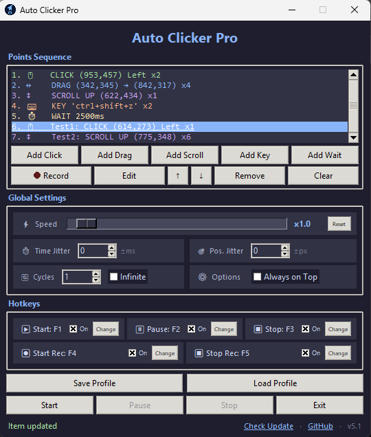

# Auto Clicker Pro

A powerful, modern **Auto Clicker** with full mouse & keyboard automation, recording, profiles, speed control, and a clean dark UI.


---

## Features

- **Click, Drag, Scroll, Keyboard & Wait** actions in one sequence
- **Record** real mouse + keyboard actions and convert them into editable points
- **Pause / Resume** — stop mid-sequence, edit the list freely, then continue
- **Speed control** (×0.1 – ×20) with live scaling of all delays, holds and drags
- **Hotkeys** for Start / Pause / Stop / Start Recording / Stop Recording (fully customizable, each can be enabled/disabled)
- **Time Jitter** (±ms) and **Position Jitter** (±px) for more human-like behavior
- **Cycles** + Infinite mode
- **Save / Load** profiles (JSON)
- **Drag & drop** reordering of points
- Copy / Cut / Paste items (Ctrl+C / Ctrl+X / Ctrl+V)
- **Live position preview** when editing — drag the on-screen marker to reposition
- Optional **name** for every action type
- **Color-coded + emoji action list** for instant recognition of each action type
- **Tooltips** on almost every control (English) for clearer usage
- Clickable **GitHub** link in the app footer
- **Check Update** — checks GitHub Releases for a newer version
- Always-on-top option
- Clean dark theme (Catppuccin-inspired)


## Screenshots



## Requirements

- Python 3.8 or higher
- [pynput](https://pypi.org/project/pynput/)

```bash
pip install pynput
```

## How to Run
```bash
git clone https://github.com/tamimialiir/AutoClickerPro.git
cd AutoClickerPro
pip install pynput
python main.py
```

## Usage Guide

### Adding Actions
| Button          | Description                                                                 |
|-----------------|-----------------------------------------------------------------------------|
| **Add Click**   | Click on screen → settings popup opens to configure the point               |
| **Add Drag**    | Press & hold, then release → settings popup opens                           |
| **Add Scroll**  | Click on screen to set position → settings popup opens                      |
| **Add Key**     | Type or capture a key / combination (`ctrl+c`, `alt+f4`...), set repeats    |
| **Add Wait**    | Insert a delay (in milliseconds)                                            |
| **Record**      | Record live mouse + keyboard actions                                        |

After capturing a Click, Drag or Scroll position, a settings dialog opens so you can set hold time, repeats, type, name, etc. before the item is added to the list.

For **Key** actions you can type the combination manually or use **Capture Key**, and also set **Repeat** count and **Delay Between Repeats**.

### Editing & Organizing
Double-click any item (or select + **Edit**) to modify it.  
While editing Click / Drag / Scroll points, an on-screen marker appears — **drag the marker** to change coordinates, or edit the numbers manually.  
Editing a **Key** action uses the same layout as Add Key (including Capture Key, Repeat, and Delay).  
Drag items in the list to reorder.  
Use ↑ / ↓ buttons or the Delete key.  
Ctrl+C / Ctrl+X / Ctrl+V for copy / cut / paste.  
You can give every item an optional **name** for easier organization.

The action list is **color-coded with emojis**:
| Action | Emoji | Color   |
|--------|-------|---------|
| Click  |  🖱️   | Green   |
| Drag   |  ↔️   | Blue    |
| Scroll |  ↕️   | Purple  |
| Wait   |  ⏱️   | Yellow  |
| Key    |  ⌨️   | Orange  |

### Global Settings
**Speed:** Global playback speed from ×0.1 to ×20 (default ×1.0). Affects waits, holds, drag duration and repeat delays. Can only be changed before Start, while Paused, or after Stop. Use **Reset** to return to ×1.0.  
**Time Jitter:** Adds random delay (±ms) to waits and repeats.  
**Position Jitter:** Slightly randomizes click / drag / scroll coordinates (±px).  
**Cycles:** How many times the whole sequence should run.  
**Infinite:** Run forever until stopped.  
**Always on Top:** Keep the window above other windows.

### Hotkeys (default)
| Action              | Default Key |
|---------------------|-------------|
| Start               |    `F1`     |
| Pause / Resume      |    `F2`     |
| Stop                |    `F3`     |
| Start Recording     |    `F4`     |
| Stop Recording      |    `F5`     |

You can change all hotkeys from the Hotkeys section.  
Media / system keys (volume, play/pause, brightness, etc.) cannot be assigned as hotkeys.


## Profile System

**Save Profile** → exports current sequence + all settings (including speed) to a `.json` file  
**Load Profile** → restores everything (points, hotkeys, jitter, speed, etc.)

Perfect for sharing macros or switching between different tasks.


## Tips

- Use **Record** for complex sequences, then clean them up with Edit.
- For more natural behavior, enable a small Time Jitter and Position Jitter.
- Name each point for better organization in long sequences.
- Drag the on-screen preview marker when editing to reposition points quickly.
- Use **Speed** above ×1 to run macros faster, or below ×1 for careful debugging.
- The app forces English keyboard layout on Windows when focused (helps with key recording).
- Use **Pause** when you need to adjust the sequence mid-run without losing progress.
- Hover over buttons and controls to see short English tooltips.
- Click **Check Update** in the bottom-right to see if a newer release is available on GitHub.
- Click the **GitHub** link in the bottom-right corner to open the project repository.


## Supported Actions

| Action   | Description                                        |
|----------|----------------------------------------------------|
| Click    | Left / Right / Middle / Double click + hold time   |
| Drag     | Smooth drag from point A to point B                |
| Scroll   | Mouse wheel up or down at specific coordinates     |
| Key      | Single key or combinations (`ctrl+shift+s`...)     |
| Wait     | Precise delay in milliseconds                      |


## What's new in v5.1

- **Color-coded action list** with emojis — 🖱️ Click (green), ↔️ Drag (blue), ↕️ Scroll (purple), ⏱️ Wait (yellow), ⌨️ Key (orange)
- **Tooltips** added to almost every control (all in English)
- Clickable **GitHub** link in the app footer
- **Check Update** — compares current version with the latest GitHub Release
- Improved **Key** dialogs: Capture Key, Repeat, and Delay Between Repeats (Add & Edit share the same layout)
- Renamed to **Auto Clicker Pro**


## What's new in v5.0

- Removed global “Defaults for New Points” — each Click / Drag opens its own settings after capture
- **Speed** slider (×0.1 – ×20) with Reset button
- Draggable on-screen markers when editing positions
- Add Scroll uses the same capture-then-configure flow as Click / Drag
- Optional name field for Wait, Key and Scroll (all action types)
- Renamed Random Time / Random Position → **Time Jitter** / **Position Jitter**
- Media / system keys blocked from hotkey assignment
- Button order: Click → Drag → Scroll → Key → Wait


## License
This project is licensed under the MIT License.  
Feel free to use, modify and distribute.


## Contributing
Pull requests are welcome!  
If you find a bug or have a feature idea, open an issue.


Made with ❤️ for automation lovers
